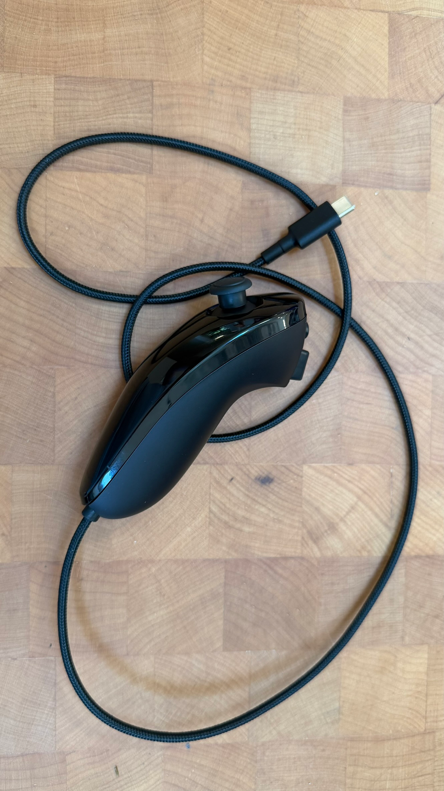
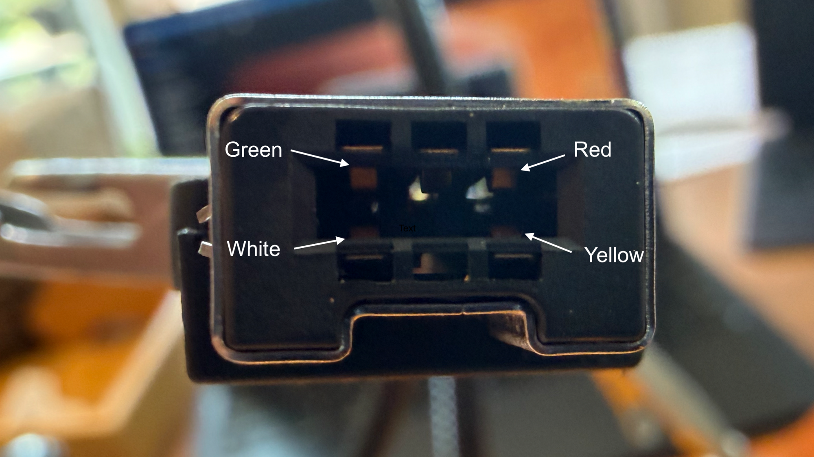
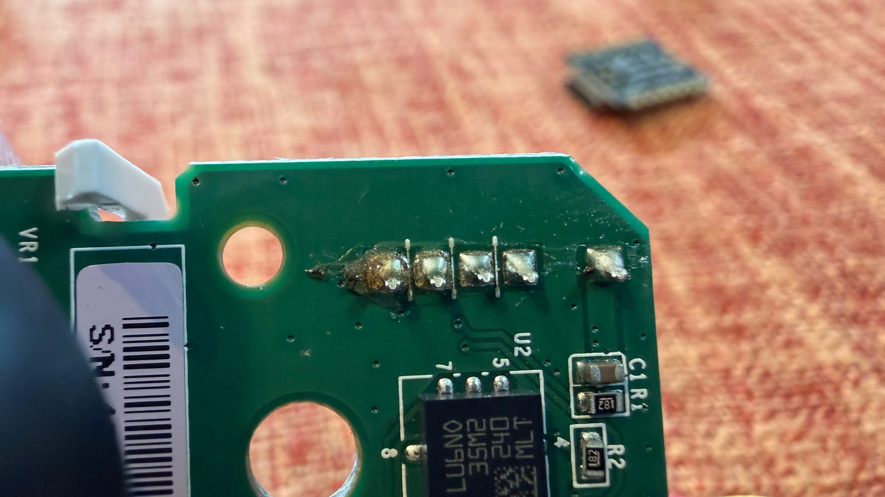
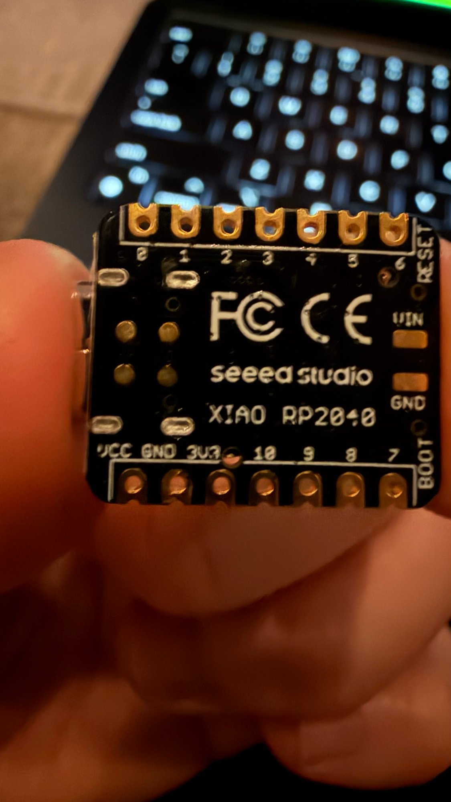
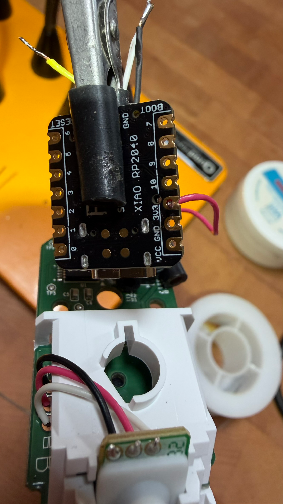
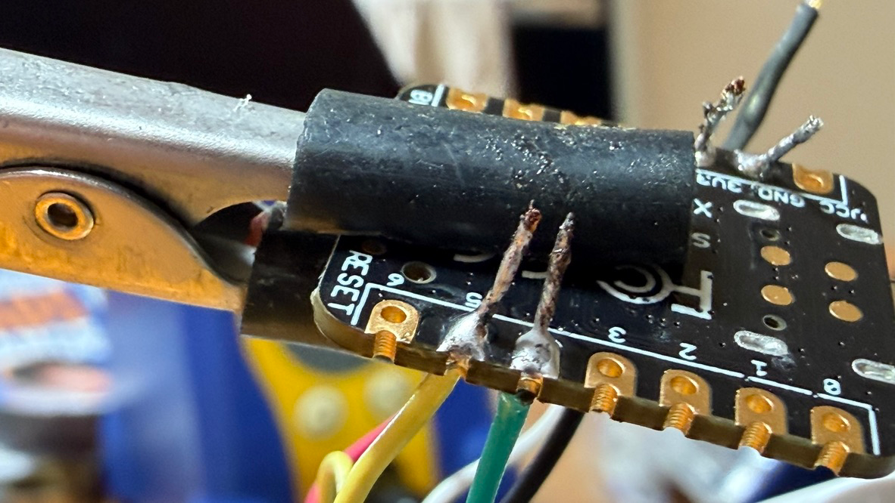
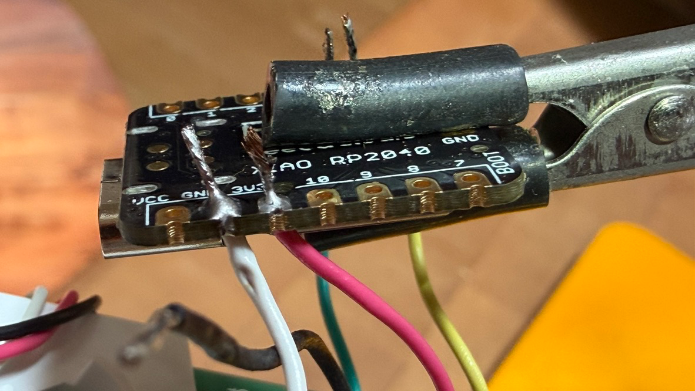
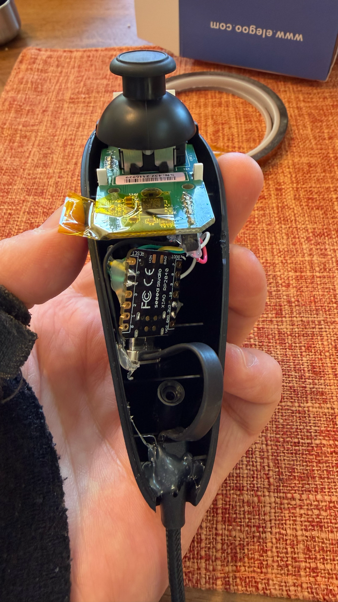

# Build Log: Wii Nunchuk → USB Game Controller (XIAO RP2040)

Converting an **official Nintendo Wii Nunchuk** into a wired **USB‑C game controller** by
gutting its original cable and soldering a **Seeed Studio XIAO RP2040** directly onto the
Nunchuk's internal I²C bus. The RP2040 runs **CircuitPython**, reads the stick / buttons, and
re‑presents them over USB as either a **mouse** or a **USB‑HID gamepad** (selectable in
`config.json`).

Built to serve as the input controller for a custom (Android‑first) mower control app.



> **Firmware / source code:** https://github.com/j4m3z0r/anavi-handle-sw

---

## How it works

A Wii Nunchuk is a **passive I²C device** (address `0x52`) containing a thumbstick, a
2‑axis accelerometer, and two buttons (C and Z). On a real Wii, the console powers it with
3.3 V and reads it over I²C. Here, the **XIAO RP2040 plays the role of the console**: it powers
the Nunchuk from its 3.3 V rail, reads it over I²C using the `adafruit_nunchuk` library, and
emits the result as a standard USB‑HID device the host already knows how to talk to.

```
Wii Nunchuk  ──I²C (3.3V)──►  XIAO RP2040  ──USB‑C HID──►  Host (Android / PC)
(stick, C, Z)                 (CircuitPython)               (mouse OR gamepad)
```

## Bill of materials

| Part | Notes |
|---|---|
| Official Nintendo Wii Nunchuk | Genuine matters — clone wire colors vary wildly |
| Seeed Studio XIAO RP2040 | RP2040 module with a USB‑C connector |
| Braided USB‑C cable | Replaces the original Wii cable |
| Thin wire, Sn60/Pb40 solder, rosin flux | |
| Heat‑shrink, hot glue, Kapton tape | Strain relief & insulation |
| **No external resistors** | The Nunchuk has its own I²C pull‑ups (see below) |

---

## Step 1 — Flash CircuitPython onto the XIAO

The board shipped with factory firmware (no CircuitPython REPL). To get into the bootloader:

- **Software trick:** opening the USB serial port at **1200 baud** and dropping DTR reboots the
  RP2040 into BOOTSEL mode; the `RPI-RP2` drive appears. (Physical alternative: hold **B** while
  pressing **R** on the XIAO.)
- **macOS gotcha:** accessing the `RPI-RP2` / `CIRCUITPY` removable volumes from the terminal
  required granting **Full Disk Access to iTerm** (System Settings → Privacy & Security), then
  restarting it.

Then:

1. Dragged the **CircuitPython 10.2.1** UF2 for `seeeduino_xiao_rp2040` onto `RPI-RP2` → the
   board reboots and a `CIRCUITPY` drive appears.
2. Copied the program files onto `CIRCUITPY`: `boot.py`, `code.py`, `config.json`,
   `hid_joystick.py`.
3. Installed the libraries with **circup**:
   ```
   circup install adafruit_bus_device adafruit_hid adafruit_nunchuk adafruit_seesaw neopixel
   ```

---

## Step 2 — Identify the Nunchuk's wires

Wire colors aren't fully reliable even on genuine units (Nintendo shipped both black‑ and
white‑grounded variants), so each wire was confirmed three independent ways:

1. **Official color convention** — Red = 3.3 V, Green = SDA, Yellow = SCL, White = GND.
2. **Connector edge‑rule** — on the 6‑pin plug, 3.3 V & SDA share one long edge; GND & SCL share
   the other. The observed layout matched.
3. **Resistance fingerprint** — using the Nunchuk's own internal pull‑ups (below): the wire that
   reads ~1.8 kΩ to two others is **Vcc**; those two are **SDA/SCL**; the wire with continuity to
   the shield/ground pour is **GND**.



**Result:** `Red = 3.3 V`, `White = GND` (the bare cable shield is also GND), `Green = SDA`,
`Yellow = SCL`.

### No external pull‑ups needed

The firmware refuses to run an I²C bus without pull‑up resistors. Conveniently, a genuine Nunchuk
**has its own ~1.8 kΩ pull‑ups on board** (R1/R2, marked `182`), and since we keep the Nunchuk's
main board in the build, those stay in‑circuit — so **no external resistors are required**.



---

## Step 3 — Solder to the XIAO RP2040

XIAO pin map (the digital pins are silk‑labelled as bare numbers; `D4`=`4`, `D5`=`5`):

| Nunchuk wire | Signal | XIAO pad |
|---|---|---|
| **Red** | 3.3 V | `3V3`  ⚠️ **not** `VCC` (that pad is ~5 V) |
| **White** + bare shield | GND | `GND` |
| **Green** | SDA (data) | `4` |
| **Yellow** | SCL (clock) | `5` |



⚠️ **The biggest trap:** the pad labelled `VCC` on the XIAO is the **~5 V USB rail**, not 3.3 V.
Putting the Nunchuk's red wire there would over‑volt and likely destroy it. The red wire goes to
**`3V3`** only. (Verify with a meter: `VCC` reads ~5 V, `3V3` ~3.3 V.)

Power wire (red → `3V3`):



Data wires (green → `4`, yellow → `5`):



Power & ground (red → `3V3`, white → `GND`):



**Soldering notes:** Sn60/Pb40 at ~345 °C / 650 °F; pre‑tin pads and wires; heat the joint (not
the solder); mind the adjacent `4`/`5` pads so SDA/SCL don't bridge; hot‑glue the joints for
strain relief.

> **Risk model:** only swapping **Vcc/GND** is destructive (it reverse‑powers the Nunchuk chip).
> Swapping **SDA/SCL** is harmless — if the bus doesn't enumerate at `0x52`, just swap the two.

---

## Step 4 — Reassemble

The XIAO and the Nunchuk's main board both fit inside the original shell. Joints were hot‑glued
for strain relief, Kapton tape kept boards from shorting, and the original Wii cable was replaced
with a braided USB‑C cable routed out the bottom.



---

## Step 5 — Firmware behaviour & tuning

`config.json` selects the USB‑HID personality, read by both `boot.py` (which enables the matching
HID device) and `code.py` (which runs the matching handler):

```json
{ "type": "joystick" }   // or "mouse" or "keyboard"
```

The NeoPixel is the status light: **green** = reading the Nunchuk happily; **red/blue** = an I²C
error (e.g. no Nunchuk / bad wiring).

Two firmware changes were made during the build:

- **Joystick‑center calibration (drift fix).** The code originally assumed the stick rests at
  `(127,127)`, but this unit rests at `(120,136)` — just enough offset to make the mouse cursor
  drift. Added `calibrate_center()`, which samples the resting position at startup and treats
  *that* as center (with an index clamp so off‑center swings don't overrun the acceleration
  tables). Applied to all three modes.
- **Joystick → Gamepad HID usage.** Changed the HID usage from **Joystick (0x04)** to
  **Gamepad (0x05)** in three places — the `boot.py` report descriptor, the `boot.py`
  `usb_hid.Device(usage=…)`, and `hid_joystick.py`'s `find_device(usage=…)` (all three must match
  or `handleJoystick` can't find its device). Android recognizes a Gamepad far more readily.

> `boot.py` only runs at power‑on and changing USB descriptors forces a re‑enumeration, so these
> changes need a **full hard reset / unplug‑replug**, not a soft reload.

---

## Step 6 — Testing

- **As a mouse** (`"type":"mouse"`): the cursor tracks the stick; C = left click, Z = right click.
  This is the quick "it's alive" check during reassembly.
- **As a gamepad** (`"type":"joystick"`): on **Android** (connected via **USB‑OTG**), it's
  recognized as a game controller — the stick drives `AXIS_X`/`AXIS_Y` and **Z → button 1**,
  **C → button 2**. ✅ Confirmed working with a gamepad‑tester.

> **macOS oddity:** macOS would *not* surface the gamepad/joystick HID input to any test tool
> (WebHID, hidapi, or the browser Gamepad API), even though the device emits reports correctly and
> **mouse mode works fine**. This is a host‑side restriction on non‑pointer HID input on macOS —
> Android (the actual target) has no such trouble.

---

## Gotchas & lessons learned (the time‑sinks)

- **macOS Full Disk Access** is required for the terminal to touch the `RPI-RP2`/`CIRCUITPY`
  removable volumes.
- **Two different USB vendor IDs:** the RP2040 *bootloader* uses Raspberry Pi's VID `0x2E8A`,
  but **CircuitPython presents Seeed's VID `0x2886`** — which matters for any host‑side filter
  (e.g. WebHID).
- **Charge‑only USB‑C cables** power the board but carry no data, so it runs (LED on) yet never
  enumerates. Always use a known **data** cable.
- **`VCC` ≠ `3V3`** on the XIAO — `VCC` is the 5 V USB rail.
- **Nunchuk has internal pull‑ups** (~1.8 kΩ) — no external resistors needed when the Nunchuk
  board stays in the loop.
- **`boot.py` changes need a hard reset** (re‑enumeration), not just a soft reload.
- **0x04 (Joystick) vs 0x05 (Gamepad)** changes whether the OS exposes it as a game controller.

---

## Files

| File | Role |
|---|---|
| `boot.py` | Defines the gamepad HID descriptor; enables the HID device per `config.json` |
| `code.py` | Reads the Nunchuk; mouse / gamepad / keyboard handlers; center calibration |
| `hid_joystick.py` | The `Joystick` HID helper class |
| `config.json` | Selects the mode: `mouse` / `joystick` / `keyboard` |
| `lib/` | CircuitPython libraries (installed via `circup`) |
